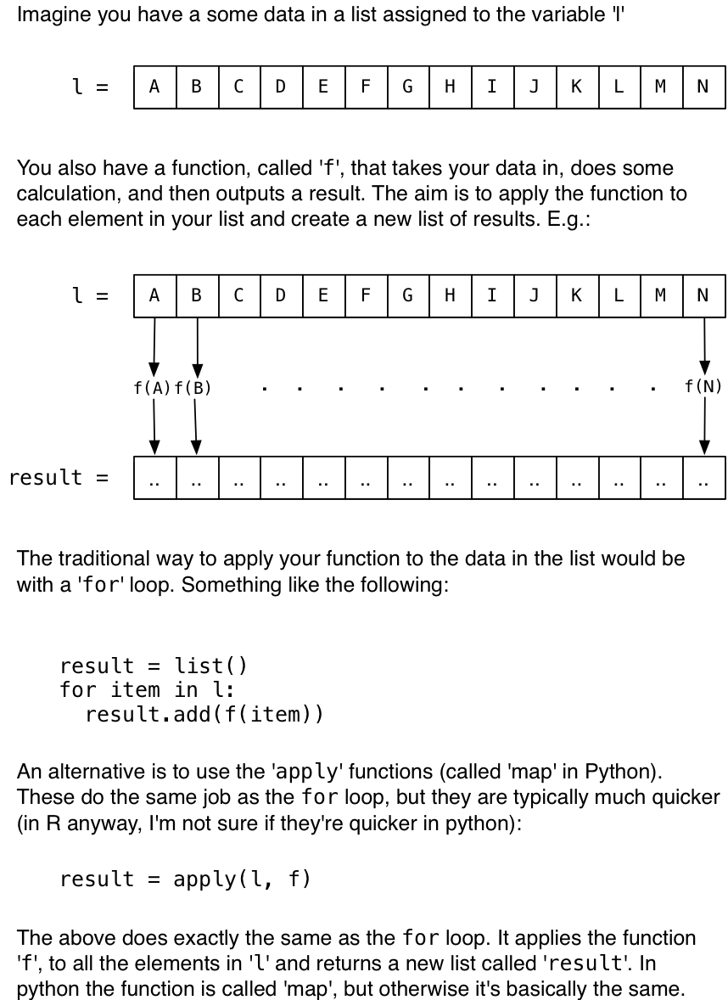

Most (all?) computers these days have lots of cores on their processors. This means that, in theory, they can do lots of things at the same time. But it can be difficult to get all the cores to work on a problem because most programming operations typically run in a single thread or process, so will only use one core. 

Happily, R and Python both have libraries that allow you to run operations in parallel. This means that all cores on the computer will work together at the same time, using the CPU to its full capacity. As an added bonus, this also makes your room nice and warm.

In this post I'll show how to do this in R and Python. If you'd like to look at the code in full, it is available on [github](https://github.com/nickmalleson/surf/blob/master/projects/extras/MultiProcess_R_Python.Rmd). I'm only going to cover the most simple example of using 'lazy' parallelisation. This is where each operation can be applied independently, so there is no need for the different processes to communicate with each other. If you want to know how to do that, look elsewhere (it isn't easy!!).


## Basics: applying a function to data

Both the R and Python parallel-processing libraries that I'm going to demonstrate work in a similar way. Basically, you write a function and apply it to a list of data. The clever bit that the parallel libraries do under the hood is to apply the function to the different data elements simultaneously. A diagram might help:



In the next sections I'll show you how to use those `apply` (or `map`) functions and make use of all cores.


## Parallel Processing in R

In the following example we're going to use the  `[parallel](http://stat.ethz.ch/R-manual/R-devel/library/parallel/doc/parallel.pdf)' package. This is a really quick overview. For more detail you should have a look at a more comprehensive tutorial. [This](https://www.r-bloggers.com/how-to-go-parallel-in-r-basics-tips/) one looks good. 

First, define a function that will do the work. It takes in a number, _x_, does something to _x_, and then returns another number as the result. What it actually does isn't important. In this example I just loop for a number of iterations, adding random numbers to the input:

```{r }
f <- function(x) {
  counter <- 0
  while(counter < 500000) {
    x <- x + runif(1, min=-1, max=1)
    counter <- counter + 1
  }
  return(x)
}
```

Second, define some data. This is going to be a list, _l_ with 50 numbers from between 1 and 200 in it.

```{r }
l <- sample(seq(1,200), size = 50, replace = TRUE)
```

Now apply the function _f_ to every number in list _l_. One way to do this is with a for loop (you can ignore the timing stuff at the start and end, this is just to record how long the code took to execute).

```{r forLoopR}
start.time <- as.integer(Sys.time())

result <- c() # A vector to store the results in
for (item in l) {
  result <- c(result, f(item))
}

time.taken <- as.integer(Sys.time()) - start.time
print(paste("Time taken", time.taken, 's'))
```

**It took `r time.taken` seconds** to use the for loop. 

Now lets do the same thing using one of the `apply` functions. These do exactly the same thing as the for loop, just in a different way. They're really useful; to learn more about them have a look at [this page](https://www.r-bloggers.com/the-r-apply-function-a-tutorial-with-examples/), or any of the others (there are lots of good tutorials on the `apply` functions).

Again you can ignore the timing stuff at the start and end, the only important line is: `result <- lapply(l, f)`

```{r applyR }
start.time <- as.integer(Sys.time())

result <- lapply(l, f)

time.taken2 <- as.integer(Sys.time()) - start.time
print(paste("Time taken", time.taken2, 's'))
```

That should have been slightly quicker, but probably not much. **It took `r time.taken2` seconds**.

Now comes the magic. We'll use the `parallel` library instead. That provides multi-process versions of the apply functions. They have '`mc`' before their name (as in multi-core). The important code in the line below looks very similar to the one above: `result <- mclapply(l, f)` (notice the '`mc`' before the `lapply`).

```{r mclapplyR, timeit = TRUE}
library(parallel)
options("mc.cores"=8)
start.time <- as.integer(Sys.time())

result <- mclapply(l, f)

time.taken3 <- as.integer(Sys.time()) - start.time
print(paste("Time taken", time.taken3, 's'))
```

That should have been quite a lot quicker depending on the number of cores in your computer. **It took `r time.taken3` seconds**.

If you have a look at how your processor is being used (e.g. with Activity Monitor on a mac or Task Manager on windows), you'll see the processor usage shoot up to 100%.

That's it! A graph to show the differences:

```{r }
times <- c(time.taken, time.taken2, time.taken3)
names(times) <- c('for loop', 'apply', 'mc-apply')
barplot(times, main="Runtime for different methods", xlab="Runtime (seconds)")
```

If you want to do the same thing in python, read on..

## Parallel Processing in Python

In this example we're going to use the [multiprocessing](https://docs.python.org/2/library/multiprocessing.html) module which is built into python. The code block below demonstrates how to use the multiprocess `map` function, which basically does the same thing as R's `apply` function above.

```{python }
import multiprocessing # To use the multi-process functions
import random          # This library is needed for when we draw a random number
import time            # For measuring how long things take

# First, define a function that will do the work. It takes in a number, x, does something to _x_, and then returns another number as the result. What it actually does isn't important. In this example I just loop for a number of iterations, adding random numbers to x:

def f(x):
  counter = 0
  while counter < 500000:
    x = x + random.uniform(-1,1)
    counter += 1
  return x

# Second, define some data. This is going to be a list with 50 numbers from between 0 and 199.

l = random.sample(range(200), 50)

# Now apply the function to every number in the list. One way to do this is with a for loop (you can ignore the timing stuff at the start and end, this is just to record how long the code took to execute).

start_time = time.time()

result = [] # A new list that will store the results of applying f to each item in l
for item in l:
  result.append( f(item) ) # Apply f to the item, and add it to the results list

print("Running the for loop took "+str(int(round((time.time()-start_time))))+" seconds.")

# Now lets do the same thing using the 'map' function. This does exactly the same thing as the for loop, just in a different way.

start_time = time.time()

result = map(f, l)

print("Running with map took "+str(int(round((time.time()-start_time))))+" seconds.")

# That will probably take about the same amount of time as the for loop.

# Now comes the magic. We'll use the map function provided by the multiprocessing library instead. That does the same thing, but it will run the function on different cores at the same time

p = multiprocessing.Pool(8) # Create a 'Pool' object that will use 8 cores

start_time = time.time()

result = p.map(f, l) # Run the multiprocesssing map function

print("Running using Pool.map took "+str(int(round((time.time()-start_time))))+" seconds.")

```

That should have been quite a lot quicker depending on the number of cores in your computer. If you have 4 cores, you should get something close to a 4 times speed up! If you have a look at how your processor is being used (e.g. with Activity Monitor on a mac or Task Manager on windows) you'll see the processor usage shoot up to 100% for the time the multiprocess functions are being used.


## That's it!

OK that's a very simple example, and it isn't always possible to divide your operations up to make them suitable for parallel processing, but sometimes those libraries really come in handy.

A word of warning though. Both the parallel `apply` functions, and `Pool.map()`, start a new process for each core that they run on. This is OK in itself, except that each process also creates a copy of all the memory the main program is using. So if your main program is using 1Gb memory, you might need another 3Gb when doing running multiprocessing code. If that becomes a problem on computers with large numbers of cores, you can always limit the number of processes that are created.